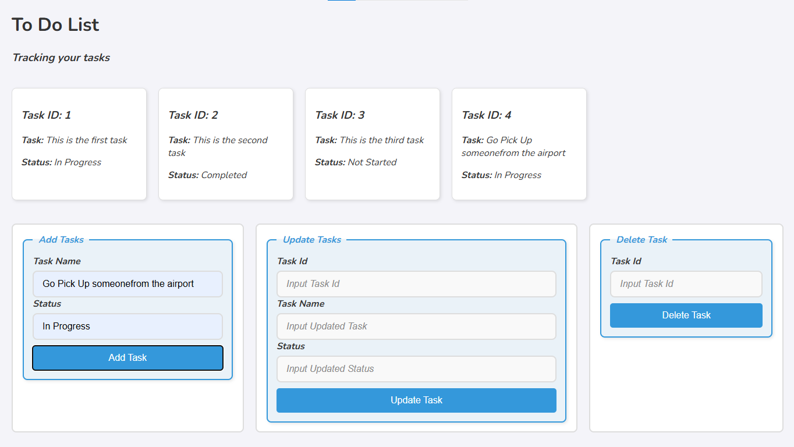
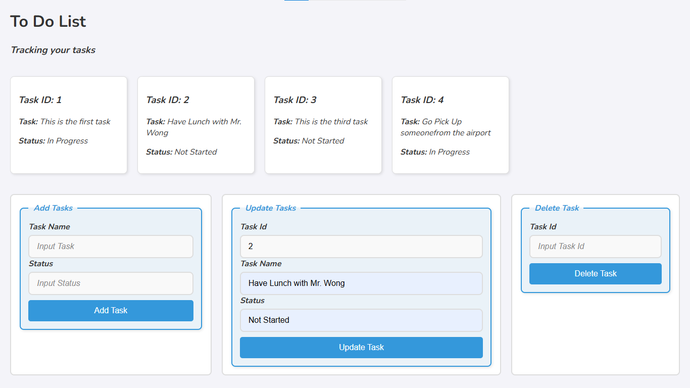
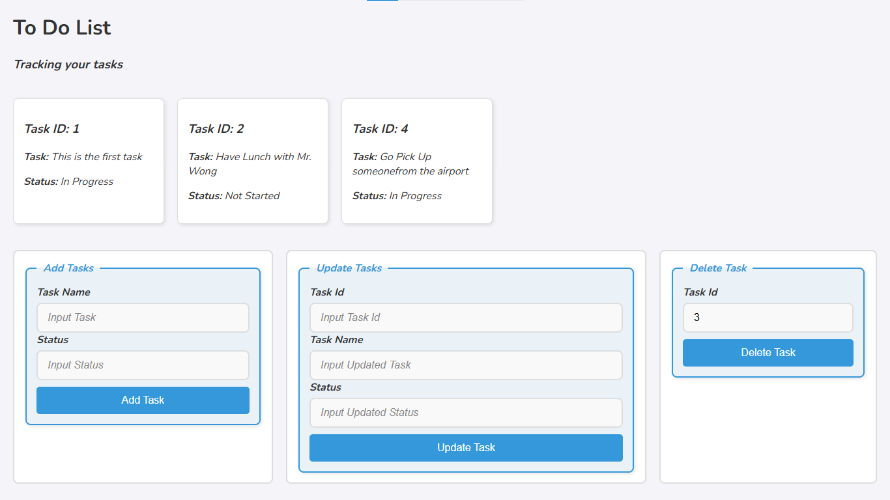

- `index.html`: The main HTML file that contains the structure of the application.
- `main.css`: The CSS file that contains the styles for the application.
- `main.js`: The JavaScript file that contains the logic for adding, updating, and deleting tasks.

### Screenshots

Here are some screenshots of the application:

#### Main Interface

*The main interface of the To Do List application.*

#### Add Task

*Form for adding a new task.*

#### Update Task

*Form for updating an existing task.*

#### Delete Task

*Form for deleting a task.*

### License

This project is licensed under the MIT License. See the LICENSE file for details.

### Acknowledgements

- [Google Fonts](https://fonts.google.com/) for the "Nunito" font.
- [Font Awesome](https://fontawesome.com/) for icons (if used).